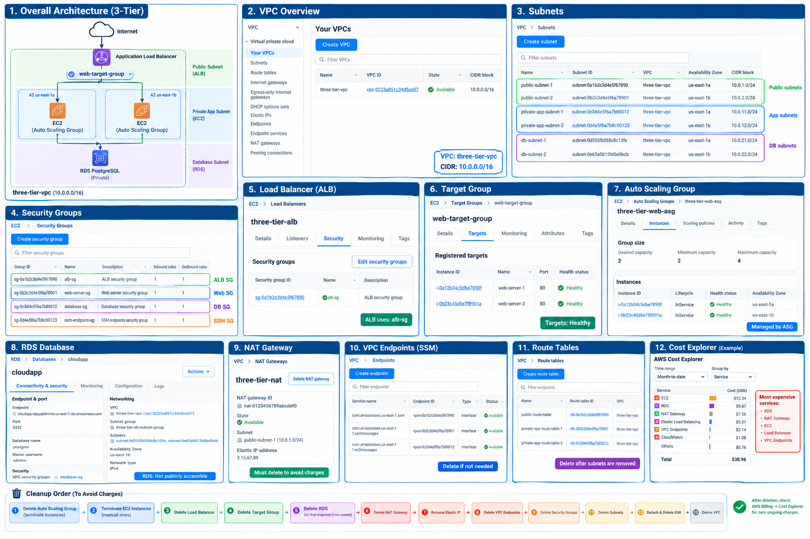

# AWS 3-Tier Web Application


This project demonstrates the design and deployment of a secure and scalable 3-tier web application architecture on Amazon Web Services (AWS).

The project was built as a hands-on cloud engineering exercise to gain practical experience with AWS networking, compute, load balancing, databases, security, monitoring, and scalability.

The architecture separates the application into three main layers:

1. **Presentation / Load Balancing Layer** — Application Load Balancer
2. **Application Layer** — EC2 instances running in private subnets
3. **Database Layer** — Amazon RDS PostgreSQL in private database subnets

---

## Architecture


### Traffic Flow

```text
Internet
   │
   ▼
Application Load Balancer
   │
   ▼
Private EC2 Instances
   │
   ▼
Amazon RDS PostgreSQL
```

The Application Load Balancer is deployed in public subnets, while the application servers and database remain in private subnets.

---

# AWS Infrastructure

## VPC

The project uses a dedicated VPC:

```text
VPC Name: three-tier-vpc
CIDR: 10.0.0.0/16
Region: us-east-1
```

The VPC is divided into public, private application, and database subnets across multiple Availability Zones.

---

## Subnet Architecture

### Public Subnets

| Subnet          | CIDR        | Availability Zone |
| --------------- | ----------- | ----------------- |
| public-subnet-1 | 10.0.1.0/24 | us-east-1a        |
| public-subnet-2 | 10.0.2.0/24 | us-east-1b        |

The public subnets are used by the Application Load Balancer and NAT Gateway.

### Private Application Subnets

| Subnet               | CIDR         | Availability Zone |
| -------------------- | ------------ | ----------------- |
| private-app-subnet-1 | 10.0.11.0/24 | us-east-1a        |
| private-app-subnet-2 | 10.0.12.0/24 | us-east-1b        |

The EC2 application servers are deployed in these private subnets.

### Database Subnets

| Subnet      | CIDR         | Availability Zone |
| ----------- | ------------ | ----------------- |
| db-subnet-1 | 10.0.21.0/24 | us-east-1a        |
| db-subnet-2 | 10.0.22.0/24 | us-east-1b        |

These subnets are used by Amazon RDS.

---

# Application Load Balancer

An Internet-facing Application Load Balancer distributes incoming HTTP traffic across the application servers.

```text
Internet
   │
   ▼
ALB
   │
   ├── EC2 Web Server 1
   │
   └── EC2 Web Server 2
```

### Configuration

```text
Load Balancer: three-tier-alb
Listener: HTTP : 80
Target Group: web-target-group
```

The ALB uses the dedicated:

```text
alb-sg
```

Security Group.

---

# EC2 Application Layer

The application layer uses Amazon EC2 instances running Amazon Linux.

The instances are deployed inside private subnets and are not directly exposed to the Internet.

Example configuration:

```text
Instance Type: t3.micro
OS: Amazon Linux 2023
Web Server: Apache HTTP Server
```

The web servers receive traffic only from the Application Load Balancer.

---

# Auto Scaling

An Auto Scaling Group was configured to manage the application instances.

```text
ASG Name: three-tier-web-asg

Minimum Capacity: 2
Desired Capacity: 2
Maximum Capacity: 4
```

The instances are distributed across the private application subnets in different Availability Zones.

This provides:

* Improved availability
* Automatic instance replacement
* Horizontal scaling
* Integration with the Application Load Balancer

---

# Amazon RDS PostgreSQL

The database layer uses Amazon RDS for PostgreSQL.

```text
Engine: PostgreSQL
Port: 5432
Database: postgres
Public Access: Disabled
```

The database is deployed inside the private database subnet group:

```text
three-tier-db-subnet-group
```

The database is not directly accessible from the public Internet.

Application-to-database communication is controlled using the database Security Group.

---

# NAT Gateway

A NAT Gateway provides outbound Internet access for resources inside private subnets.

```text
Private EC2
     │
     ▼
NAT Gateway
     │
     ▼
Internet Gateway
     │
     ▼
Internet
```

This allows private EC2 instances to download packages and updates without assigning public IP addresses.

NAT Gateway:

```text
three-tier-nat
```

---

# Internet Gateway

The VPC uses:

```text
three-tier-igw
```

The Internet Gateway provides Internet connectivity for resources in public subnets.

It is also used as part of the NAT Gateway's outbound path.

---

# Route Tables

Public subnets use a route table containing:

```text
10.0.0.0/16 → local
0.0.0.0/0   → Internet Gateway
```

Private application subnets use routes such as:

```text
10.0.0.0/16 → local
0.0.0.0/0   → NAT Gateway
```

This keeps application servers private while still allowing required outbound connectivity.

---

# Security Groups

Multiple Security Groups were used to implement network-level access control.

## ALB Security Group

```text
alb-sg
```

Allows:

```text
HTTP : 80
Source: Internet
```

---

## Web Server Security Group

```text
web-server-sg
```

Allows:

```text
HTTP : 80
Source: alb-sg
```

This means the EC2 servers do not need to accept HTTP traffic directly from the Internet.

---

## Database Security Group

```text
database-sg
```

Allows:

```text
PostgreSQL : 5432
Source: web-server-sg
```

This limits database access to the application layer.

---

# AWS Systems Manager

AWS Systems Manager was used to manage private EC2 instances without requiring direct public SSH access.

The EC2 instances use the IAM role:

```text
EC2-SSM-Role
```

with:

```text
AmazonSSMManagedInstanceCore
```

VPC interface endpoints were also configured for Systems Manager communication.

This provides a more secure management approach for private instances.

---

# Monitoring

Amazon CloudWatch can be used to monitor infrastructure metrics and application resources.

Relevant metrics include:

* EC2 CPU utilization
* Network traffic
* Application Load Balancer metrics
* Target health
* RDS monitoring
* Auto Scaling activity

CloudWatch Logs can also be used for troubleshooting and operational visibility.

---

# Technologies Used

| Category         | Technology                |
| ---------------- | ------------------------- |
| Cloud Platform   | AWS                       |
| Networking       | Amazon VPC                |
| Compute          | Amazon EC2                |
| Load Balancing   | Application Load Balancer |
| Scaling          | Auto Scaling              |
| Database         | Amazon RDS PostgreSQL     |
| Monitoring       | Amazon CloudWatch         |
| Management       | AWS Systems Manager       |
| Identity         | AWS IAM                   |
| Operating System | Amazon Linux 2023         |
| Web Server       | Apache HTTP Server        |

---

# Key Learning Outcomes

Through this project, I gained practical experience with:

* Designing AWS VPC architectures
* Creating public and private subnets
* Working with route tables
* Configuring Internet and NAT Gateways
* Deploying EC2 instances
* Configuring Apache on Linux
* Building Application Load Balancers
* Configuring target groups and health checks
* Implementing Auto Scaling
* Deploying private RDS databases
* Configuring Security Groups
* Managing private EC2 instances using Systems Manager
* Understanding AWS networking and security
* Monitoring cloud infrastructure with CloudWatch
* Managing AWS resources and project costs

---

# Project Structure

```text
aws-3-tier-web-application/
│
├── architecture.png
│
└── README.md
```

---

# Cost Awareness

Several AWS resources used in this project can generate charges depending on usage and account eligibility.

Resources that require particular attention include:

* NAT Gateway
* Application Load Balancer
* Amazon RDS
* EC2 instances
* VPC Interface Endpoints
* Elastic IP addresses
* Data transfer

After completing the project, unused resources should be removed to prevent unnecessary charges.

---

# Cleanup

Before deleting the infrastructure, important project screenshots and documentation should be saved.

Recommended cleanup order:

1. Delete the Auto Scaling Group
2. Terminate remaining EC2 instances
3. Delete the Application Load Balancer
4. Delete the Target Group
5. Delete the RDS database
6. Delete the NAT Gateway
7. Release unused Elastic IP addresses
8. Delete unused VPC Interface Endpoints
9. Delete Security Groups
10. Delete Route Tables
11. Delete Subnets
12. Detach and delete the Internet Gateway
13. Delete the VPC

AWS Billing and Cost Explorer should also be checked after cleanup because billing information may take some time to update.

---

# Conclusion

This project provided practical experience in designing and deploying a multi-tier AWS infrastructure with a strong focus on networking, security, scalability, and cloud operations.

It combines several AWS services into a realistic architecture rather than deploying a single standalone EC2 instance.

The project represents a practical step toward developing skills in:

**Cloud Engineering | Network Engineering | AWS Infrastructure | Cloud Security | DevOps**
